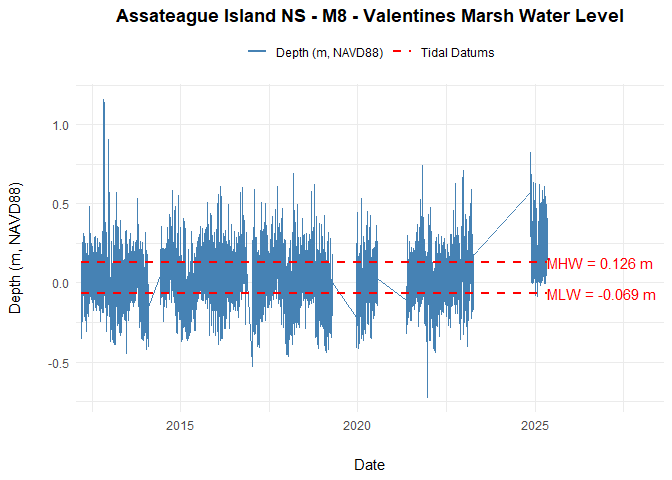

<!-- README.md is generated from README.Rmd. Please edit that file -->

# NCBNAqua

NCBNAqua provides functions for downloading and working with water data
for the NCBN protocols from the NPS Aquarius database.This package
utilizes the National Park Service
[fetchaquarius](https://github.com/nationalparkservice/imd-fetchaquarius)
package for the API connection to the database.

## Installation

You can install the development version of NCBNAqua from
[GitHub](https://github.com/) with:

``` r
# install.packages("pak")
pak::pak("laura-feher/NCBNAqua")
```

## Set & store API credentials

The first time you use the package, you’ll need to set and store
credentials for the Aquarius API using the
[keyring](https://keyring.r-lib.org/) package. Running the function
keyring::key_set() will open a dialog box that will prompt you for a
password. Note that this only needs to be done once. Contact laura_feher
at nps.gov for more info.

``` r
library(keyring)

# keyring::key_set("aquarius", "aqreadonly")
```

## Establish a connection to Aquarius

Use the function connectToAquarius from the fetchaquarius package to
establish a connection to the API. Note that this only needs to be run
once per session.

``` r
library(tidyverse)
library(NCBNAqua)
library(fetchaquarius)

# establish connection to Aquarius
fetchaquarius::connectToAquarius("aqreadonly")
```

## Download water data for a specific NCBN park and protocol

The function get_wl_data() downloads the data from Aquarius and formats
it into a single data frame.

``` r
# Download water level data from the SET sites at ASIS
asis_set_wl <- get_wl_data(park_code = "ASIS", protocol = "SET")

head(asis_set_wl)
#>                                        Name
#> 1 Assateague Island NS - M5 -Pope Bay Marsh
#> 2 Assateague Island NS - M5 -Pope Bay Marsh
#> 3 Assateague Island NS - M5 -Pope Bay Marsh
#> 4 Assateague Island NS - M5 -Pope Bay Marsh
#> 5 Assateague Island NS - M5 -Pope Bay Marsh
#> 6 Assateague Island NS - M5 -Pope Bay Marsh
#>                               Identifier LocationIdentifier park Unit
#> 1 Depth.meters NAVD88@ASIS_M5_WaterLevel ASIS_M5_WaterLevel ASIS    m
#> 2 Depth.meters NAVD88@ASIS_M5_WaterLevel ASIS_M5_WaterLevel ASIS    m
#> 3 Depth.meters NAVD88@ASIS_M5_WaterLevel ASIS_M5_WaterLevel ASIS    m
#> 4 Depth.meters NAVD88@ASIS_M5_WaterLevel ASIS_M5_WaterLevel ASIS    m
#> 5 Depth.meters NAVD88@ASIS_M5_WaterLevel ASIS_M5_WaterLevel ASIS    m
#> 6 Depth.meters NAVD88@ASIS_M5_WaterLevel ASIS_M5_WaterLevel ASIS    m
#>           Label            datetime       date     time water_level is_navd88
#> 1 meters NAVD88 2012-03-07 17:00:00 2012-03-07 17:00:00      -0.110      TRUE
#> 2 meters NAVD88 2012-03-07 17:15:00 2012-03-07 17:15:00      -0.112      TRUE
#> 3 meters NAVD88 2012-03-07 17:30:00 2012-03-07 17:30:00      -0.122      TRUE
#> 4 meters NAVD88 2012-03-07 17:45:00 2012-03-07 17:45:00      -0.126      TRUE
#> 5 meters NAVD88 2012-03-07 18:00:00 2012-03-07 18:00:00      -0.132      TRUE
#> 6 meters NAVD88 2012-03-07 18:15:00 2012-03-07 18:15:00      -0.138      TRUE
```

``` r
# Download seagrass water data (all parameters) from CACO
caco_seagrass_wl <- get_wl_data(park_code = "CACO", protocol = "ENE_Seagrass")

head(caco_seagrass_wl)
#>          Name                               Identifier LocationIdentifier Unit
#> 1 Duck Harbor Absolute Pressure.kPa@CACO_DH_WaterLevel CACO_DH_WaterLevel  kPa
#> 2 Duck Harbor Absolute Pressure.kPa@CACO_DH_WaterLevel CACO_DH_WaterLevel  kPa
#> 3 Duck Harbor Absolute Pressure.kPa@CACO_DH_WaterLevel CACO_DH_WaterLevel  kPa
#> 4 Duck Harbor Absolute Pressure.kPa@CACO_DH_WaterLevel CACO_DH_WaterLevel  kPa
#> 5 Duck Harbor Absolute Pressure.kPa@CACO_DH_WaterLevel CACO_DH_WaterLevel  kPa
#> 6 Duck Harbor Absolute Pressure.kPa@CACO_DH_WaterLevel CACO_DH_WaterLevel  kPa
#>   Label           Timestamp       Date     Time   Value
#> 1   kPa 2019-07-30 20:15:03 2019-07-30 20:15:03 101.548
#> 2   kPa 2019-07-30 20:21:03 2019-07-30 20:21:03 101.556
#> 3   kPa 2019-07-30 20:27:03 2019-07-30 20:27:03 101.549
#> 4   kPa 2019-07-30 20:33:03 2019-07-30 20:33:03 101.538
#> 5   kPa 2019-07-30 20:39:03 2019-07-30 20:39:03 114.778
#> 6   kPa 2019-07-30 20:45:03 2019-07-30 20:45:03 114.916
```

## Filter water data to a specific site or parameter

The function get_sites() prints a list of all sites in the previously
downloaded CACO Seagrass water data. You can then use the site names to
filter the data to a specific site.

``` r
# Print a list of the sites in the CACO Seagrass water data
get_sites(caco_seagrass_wl) %>%
  head()
#>           Name                                        Identifier
#> 1  Duck Harbor          Absolute Pressure.kPa@CACO_DH_WaterLevel
#> 2  Duck Harbor                   Depth.meters@CACO_DH_WaterLevel
#> 3  Duck Harbor          Unspec Temperature.°C@CACO_DH_WaterLevel
#> 4  Duck Harbor            WaterLevelNAVD88.18@CACO_DH_WaterLevel
#> 5  Duck Harbor WaterLevelNAVD88.Historical.18@CACO_DH_WaterLevel
#> 6 Pleasant Bay          Absolute Pressure.kPa@CACO_PB_WaterLevel

# Filter to just Duck Harbor
caco_dh_seagrass_wl <- caco_seagrass_wl %>%
  filter(Name == "Duck Harbor")

head(caco_dh_seagrass_wl)
#>          Name                               Identifier LocationIdentifier Unit
#> 1 Duck Harbor Absolute Pressure.kPa@CACO_DH_WaterLevel CACO_DH_WaterLevel  kPa
#> 2 Duck Harbor Absolute Pressure.kPa@CACO_DH_WaterLevel CACO_DH_WaterLevel  kPa
#> 3 Duck Harbor Absolute Pressure.kPa@CACO_DH_WaterLevel CACO_DH_WaterLevel  kPa
#> 4 Duck Harbor Absolute Pressure.kPa@CACO_DH_WaterLevel CACO_DH_WaterLevel  kPa
#> 5 Duck Harbor Absolute Pressure.kPa@CACO_DH_WaterLevel CACO_DH_WaterLevel  kPa
#> 6 Duck Harbor Absolute Pressure.kPa@CACO_DH_WaterLevel CACO_DH_WaterLevel  kPa
#>   Label           Timestamp       Date     Time   Value
#> 1   kPa 2019-07-30 20:15:03 2019-07-30 20:15:03 101.548
#> 2   kPa 2019-07-30 20:21:03 2019-07-30 20:21:03 101.556
#> 3   kPa 2019-07-30 20:27:03 2019-07-30 20:27:03 101.549
#> 4   kPa 2019-07-30 20:33:03 2019-07-30 20:33:03 101.538
#> 5   kPa 2019-07-30 20:39:03 2019-07-30 20:39:03 114.778
#> 6   kPa 2019-07-30 20:45:03 2019-07-30 20:45:03 114.916
```

The function get_parameters prints a list of all water parameters in the
previously downloaded CACO Seagrass water data. You can then use the
Identifier, Unit, or Label to filter the data to a specific parameter.

``` r
# Print a list of the parameters in the CACO Seagrass water data
get_parameters(caco_seagrass_wl) %>%
  head()
#>           Name                                        Identifier Unit
#> 1  Duck Harbor          Absolute Pressure.kPa@CACO_DH_WaterLevel  kPa
#> 2  Duck Harbor                   Depth.meters@CACO_DH_WaterLevel    m
#> 3  Duck Harbor          Unspec Temperature.°C@CACO_DH_WaterLevel degC
#> 4  Duck Harbor            WaterLevelNAVD88.18@CACO_DH_WaterLevel    m
#> 5  Duck Harbor WaterLevelNAVD88.Historical.18@CACO_DH_WaterLevel    m
#> 6 Pleasant Bay          Absolute Pressure.kPa@CACO_PB_WaterLevel  kPa
#>           Label
#> 1           kPa
#> 2        meters
#> 3            °C
#> 4            18
#> 5 Historical.18
#> 6           kPa

# Filter to just water temp
caco_watertemp_seagrass_wl <- caco_seagrass_wl %>%
  filter(Unit == "degC")

head(caco_watertemp_seagrass_wl)
#>          Name                               Identifier LocationIdentifier Unit
#> 1 Duck Harbor Unspec Temperature.°C@CACO_DH_WaterLevel CACO_DH_WaterLevel degC
#> 2 Duck Harbor Unspec Temperature.°C@CACO_DH_WaterLevel CACO_DH_WaterLevel degC
#> 3 Duck Harbor Unspec Temperature.°C@CACO_DH_WaterLevel CACO_DH_WaterLevel degC
#> 4 Duck Harbor Unspec Temperature.°C@CACO_DH_WaterLevel CACO_DH_WaterLevel degC
#> 5 Duck Harbor Unspec Temperature.°C@CACO_DH_WaterLevel CACO_DH_WaterLevel degC
#> 6 Duck Harbor Unspec Temperature.°C@CACO_DH_WaterLevel CACO_DH_WaterLevel degC
#>   Label           Timestamp       Date     Time  Value
#> 1    °C 2019-07-30 20:15:03 2019-07-30 20:15:03 37.055
#> 2    °C 2019-07-30 20:21:03 2019-07-30 20:21:03 36.728
#> 3    °C 2019-07-30 20:27:03 2019-07-30 20:27:03 34.268
#> 4    °C 2019-07-30 20:33:03 2019-07-30 20:33:03 33.014
#> 5    °C 2019-07-30 20:39:03 2019-07-30 20:39:03 27.961
#> 6    °C 2019-07-30 20:45:03 2019-07-30 20:45:03 27.468
```

## Save water data to Excel

You can use the function write.xlsx() from the
[openxlsx](https://ycphs.github.io/openxlsx/) package to save the
downloaded data to an excel file.

``` r
library(openxlsx)

# First, filter the ASIS water level data to Valentines (M8)
asis_m8_set_wl <- asis_set_wl %>%
  filter(Name == "Assateague Island NS - M8 - Valentines Marsh")
```

``` r
# Then save the water level data from Valentines to excel and put it in the "data" folder
write.xlsx(asis_m8_set_wl, file = "data/asis_m8_set_wl.xlsx")
```

## Working with NAVD88 water level data

NOTE: The remaining functions in the package are meant to be used only
with water level data referenced to NAVD88 from the SET sites.

``` r
# Get tidal datums for the sites at ASIS
tidal_datums(wl_data = asis_set_wl)
#> # A tibble: 3 × 10
#> # Groups:   Identifier, Name, LocationIdentifier [3]
#>   Name      Identifier LocationIdentifier   MHW  MHHW     MLW    MLLW first_date
#>   <chr>     <chr>      <chr>              <dbl> <dbl>   <dbl>   <dbl> <chr>     
#> 1 Assateag… Depth.met… ASIS_M5_WaterLevel 0.156 0.173 -0.0420 -0.0600 2012-03-07
#> 2 Assateag… Depth.met… ASIS_M6_WaterLevel 0.156 0.177 -0.0519 -0.0741 2012-03-07
#> 3 Assateag… Depth.met… ASIS_M8_WaterLevel 0.126 0.145 -0.0686 -0.0867 2012-03-08
#> # ℹ 2 more variables: last_date <chr>, record_count <int>
```

## Plot water level with tidal datums

The function plot_water_level_with_datums() can be used to plot the
NAVD88 water level with horizontal lines showing the calculated tidal
datums. Note that the data must either be filtered to a single site
before using the function or you must use the ‘site’ parameter within
the function to filter the data to a single site.

``` r
# Use dplyr::filter to select a single site and then plot the data
asis_set_wl %>%
  filter(Name == "Assateague Island NS - M8 - Valentines Marsh") %>%
  plot_water_level_with_datums(wl_data = .)
```


``` r

# OR specify a single site using the site parameter within the plotting function
plot_water_level_with_datums(wl_data = asis_set_wl, site = "Assateague Island NS - M8 - Valentines Marsh")
```



``` r

# OR save data from a single site to a separate df (see above section "Save water data to Excel") and then plot the data
plot_water_level_with_datums(wl_data = asis_m8_set_wl)
```


To include MHHW and MLLW in the plot, use include_extremes = TRUE

``` r
plot_water_level_with_datums(wl_data = asis_m8_set_wl, include_extremes = TRUE)
```


## Save tidal datums and plot to Excel

The function save_water_level_with_datums() will save the water level
data, tidal datums, and plot to an excel file. Note that the water level
data must be filtered to a single site.

``` r
save_water_level_with_datums(
  wl_data = asis_m8_set_wl, 
  folder = "data", 
  file_name = "ASIS_M8_Plotting", 
  overwrite = TRUE
  )
```
